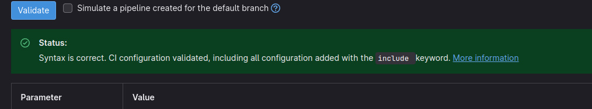

# Task solution

## Explanation of the [.gitlab-ci.yml](.gitlab-ci.yml)

* The first step was to define stages for the pipeline. This is done by using the stages keyword and listing the names of the stages in order. In this case, I defined five stages: verify_version, test, lint, build and publish. These stages represent different phases of the development process and allow to group and order the jobs accordingly.
* The second step in creating the .gitlab-ci.yml file was to choose a base image for all jobs in the pipeline. Since I wanted the version of the docker image used not to be hardcoded, I decided to set the variable *NODE_VERSION* to what is defined in package.json's engines.node, which is happening in lines 14-17, in the `.set_node_version` section, which is then used to extend other jobs.

  * I decided to define two sections: `.set_node_version` & `.image` to avoid repetition, following the [DRY principle](https://en.wikipedia.org/wiki/Don%27t_repeat_yourself), and to allow extendability & keep it simple, following the [KISS principle](https://people.apache.org/~fhanik/kiss.html). Referencing the sections (YAML anchors) in GitLab's job definitions is both easier & allows for more flexibility, since it's easier to change the commands in one place and see all the areas the changes will affect & as in the future we might want to add more commands into specific job's before_script/script. This possiblity to extend a certain job's before_script comes at a small cost, since the minimal solution, [.gitlab-ci-minimal-solution.yml](.gitlab-ci-minimal-solution.yml) which has the image definition moved into `.set_node_version` & uses GitLab's `extend` to define a before_script for each job, is a dozen lines shorter. Both solution are correct, but the main one presented, [.gitlab-ci.yml](.gitlab-ci.yml), is the one which would be easier to maintain & extend.
  * In the case of the provided package.json, the version of the node image would be 16.0.0. This ensures that the Node.js version used in the pipeline is consistent with the package requirements. This works unless the version specified begins with just '>' or '<', instead of '>=', or '<='.
  * I did not want to spend more time to implement the logic that would handle just the lesser/greater than versioning, as I interpreted the task to be more focused on the approach to the problem, not just the solution. If we wanted to have this behavior we'd have to find the next smaller/larger version than the one specified out of all the available ones.
* The next step was to define variables that can be used in any job in the pipeline. I defined two variables: *NPM_REGISTRY_USER_NAME* and *NPM_REGISTRY_USER_PASSWORD*, which store the username and password for logging into the private npm registry. These variables are sensitive information that should not be exposed in plain text, as specified in the task, so I stored them as protected variables in the CI/CD settings of the GitLab repository.
* The fourth step was to define `.set_config`, which acts like a "before_script" inside the node container, and is run before each job in the pipeline. This is done by defining a section with YAML anchor and listing a set of commands that are executed in order. In this case, I used a set of commands:

  * The first command uses the `node --print` command to get the registry URL from the package.json file. The command evaluates a JavaScript expression and prints the result to stdout. In this case, it reads the publishConfig.registry field of the package.json file and assigns it to a variable called NPM_REGISTRY.
  * The commands 2-5 set the proper variables and store them in the `~/.npmrc` file. The command 6, which is the `npm login` command allows to authenticate against a registry. In this case, it uses the registry URL and credentials that were set in the protected variables. Due to my recent infamiliarity with npm, I had to search for information how to do it via command line, and I found this [npm login](https://docs.npmjs.com/cli/v9/commands/npm-login) & [npm config](https://docs.npmjs.com/cli/v9/using-npm/config) articles/manpages. According to other sources & local testing I also have to specify the email. Since it wasn't provided in the devops task's contents, I decided to set it to username + @rtbhouse.com, so user@rtbhouse.com. No scope was defined in the task as well, I assumed the scope to be *team*, as it was specified as the author of the package.
  * The last command installs the dependencies of the package. The `npm install` command reads the package.json file and downloads the packages listed in the dependencies and devDependencies fields. Since the task did not consider additional environments, I decided to install both the dependencies and the devDependencies, as it leads to a working environment, without any errors. One could make an argument that deciding to install unwanted/not needed dependencies is not a good practice, as it introduces a harder-to-spot problem of unused dependencies, prolonging the pipeline execution time and wastes developer time. In this case, I decided to choose the "safe" option, which would lead to a working solution.
* The fifth step was to define jobs for each stage. A job is a set of commands that are executed on a runner that runs the pipelines. A job is defined by using its name as a keyword and providing some attributes. In this case, I defined five jobs. First four of which run only for merge requests:

  * The verify_version job belongs to the verify_version stage. Its purpose is to check if the current version of the package (defined in package.json) is valid for publishing. It does so by using two commands:

    * The first command runs a list of commands defined in the `.set_config` section, setting config & installing dependencies.
    * The next two commands use `node --print` to get the current version & package name from package.json and assign them to variables *CURRENT_VERSION* & *PACKAGE_NAME*.
    * The fourth command uses `npm view` to get a list of versions that have been published for this package name and assigns it to a variable *VERSIONS*. The npm view command allows to view metadata of packages from a registry. In this case, it returns an array of version numbers in JSON format.
    * The fifth command uses echo and grep to check if *CURRENT_VERSION* is present in *VERSIONS*. If it is, it means that this version has been already published and cannot be published again, so it prints an error message and exits with code 1 (which fails the job).
    * The sixth command uses `npm view` again to get the latest version that has been published for this package name and assigns it to a variable called *LATEST_VERSION*.
    * The seventh command uses printf, sort and head to compare *CURRENT_VERSION* and *LATEST_VERSION*. If *CURRENT_VERSION* is lower than *LATEST_VERSION*, it means that this version is outdated and cannot be published, so it prints an error message and exits with code 1 (which fails the job).
  * The test, lint & build jobs are similar, as they are the same, but run different run/lint/build scripts:

    * The first command runs a list of commands defined in the `.set_config` section, setting config & installing dependencies.
    * The second command uses `npm run <script>` to run the script according to the job's name. The `npm run` command executes a script defined in package.json. In case of:
      * test - runs `jest`, which is a testing framework for JavaScript and TypeScript,
      * lint - runs `eslint`, which is a tool for finding and fixing problems in code,
      * build - runs `tsc`, which is a compiler for TypeScript. It compiles the TypeScript files into JavaScript files and outputs them in the lib folder.
    * I've defined the jobs based on the `.run_script` template, which wasn't necessary, but since there were already 3 scripts, and there might be more in the future, it was a good practice to create a template for jobs running the scripts.
* The last, fifth job, publish, belongs to the publish stage and runs only for main branch after merging the merge request, or more specifically, on pushes to master. Its purpose is to publish the package to the private npm registry. It does so by using two commands:

  * The first command runs a list of commands defined in the `.set_config` section, setting config & installing dependencies, as explained before.
  * The second command uses npm publish to publish the package to the registry. The npm publish command uploads the package files and metadata to a registry. In this case, it uses the registry URL and scope that were set in the before_script, and publishes the package with restricted access. This means that only users who are logged in to the registry can install or view this package.
  * To have the pipeline run after the merge, the project needs to have enabled merged results pipelines, as defined [in the docs](https://docs.gitlab.com/ee/ci/pipelines/merged_results_pipelines.html#enable-merged-results-pipelines)
* No [tags](https://docs.gitlab.com/ee/ci/yaml/#tags) have been defined for jobs, as the task did not specify any information about the environments and/or runners.
* I've also checked whether the configuration is valid using GitLab's CI lint tool: 

## .gitlab-ci.yml [with cache](.gitlab-ci-cache.yml)

I've attempted to create the same pipeline, but with cache enabled so the jobs don't have to download the dependencies each time they're run & just use the cached dependencies. The changes are in lines 30-39 & 113-117.
I know it wasn't required, but since I've worked with & implemented cache before, just not for this type of application/package, I wanted to give it a try.
Due to my infamiliarity with npm/Node.js I'd like it to be considered as just an attempt.

## Bonus task

> Please explain how you would set up this Gitlab CI configuration for a group of repositories where the contents of the gitlab-ci.yml file are not duplicated in every repository - i.e. there is a Single Source of Truth for Gitlab CI configuration. Describe the setup in detail, including information about particular Gitlab CI functionalities that would be used.

Since I have not yet implemented anything like this, this is a theoretical implementation of the solution.

I would set up this GitLab CI configuration for a group of repositories where the contents of the gitlab-ci.yml file are not duplicated in every repository by using the [include](https://docs.gitlab.com/ee/ci/yaml/#include) & [extends](https://docs.gitlab.com/ee/ci/yaml/#extends) keywords.
The include keyword allows to include an external YAML file in the current one. This allows to reuse the same configuration across multiple projects.
The extends keyword allows to extend the configuration of a job. This allows to reuse the same configuration across multiple jobs.
The include and extends keywords can be used together to create a Single Source of Truth for GitLab CI configuration.
In this case, I would create a separate repository with the GitLab CI configuration, and include it in the other repositories. This would allow to reuse the same configuration across multiple repositories. The configuration could look like this:

```yaml
include:
  - project: 'gitlab.com/rtbhouse/devops-task'
    ref: main
    file: '/.gitlab-ci.yml'
```

I would also create a template for the jobs, and extend it in the other jobs. This would allow to reuse the same configuration across multiple jobs. The configuration could look like this:

```yaml
.build-template:
  before_script:
    - *set_config
    - npm run build

publish:
  extends: .build-template
  stage: publish
  only:
    - main
  script:
    - npm publish
```
